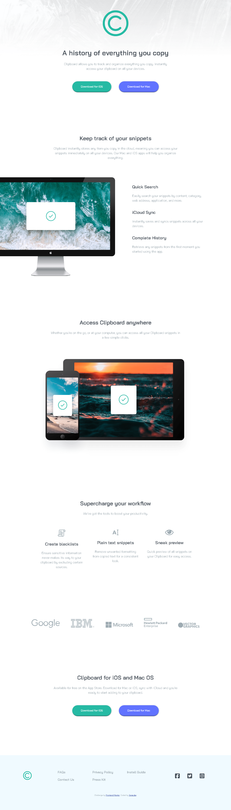

# Frontend Mentor - Clipboard landing page solution

This is a solution to the [Clipboard landing page challenge on Frontend Mentor](https://www.frontendmentor.io/challenges/clipboard-landing-page-5cc9bccd6c4c91111378ecb9). Frontend Mentor challenges help you improve your coding skills by building realistic projects. 

## Table of contents

- [Overview](#overview)
  - [The challenge](#the-challenge)
  - [Screenshot](#screenshot)
  - [Links](#links)
- [My process](#my-process)
  - [Built with](#built-with)
  - [What I learned](#what-i-learned)
  - [Continued development](#continued-development)
  - [Useful resources](#useful-resources)
- [Author](#author)
- [Acknowledgments](#acknowledgments)

**Note: Delete this note and update the table of contents based on what sections you keep.**

## Overview
The project is a clipboard landing page. The goal is to recreate the design from frontendmentor
to be responsive.

### The challenge

Users should be able to:

- View the optimal layout for the site depending on their device's screen size
- See hover states for all interactive elements on the page

### Screenshot

### Links

- Solution URL: [Add solution URL here](https://your-solution-url.com)
- Live Site URL: [Add live site URL here](https://your-live-site-url.com)

## My process

### Built with

- Semantic HTML5 markup
- CSS custom properties
- Flexbox
- CSS Grid
- Mobile-first workflow

### What I learned

This project helped to understand the importance of building reuseable css styles. creating paddings, margins and other forms of spacing using grid system.

To see how you can add code snippets, see below:

### Continued development

To continue my quest to become one of the best full stack web developer, i will continue to learn for css and more frameworks like tailwind, reacting and vue js.

### Useful resources

- [web.dev](https://web.dev/learn/css/) - This is an amazing article which helped me finally understand css. I'd recommend it to anyone still learning this concept.

## Author

- Frontend Mentor - [@Jerryhugo](https://www.frontendmentor.io/profile/jerryhugo)
- Twitter - [Sage.dev](https://www.twitter.com/insp_family)

## Acknowledgments

A huge thanks to frontend mentor for creating these challanges. They are really helping me to refresh my css codes.

